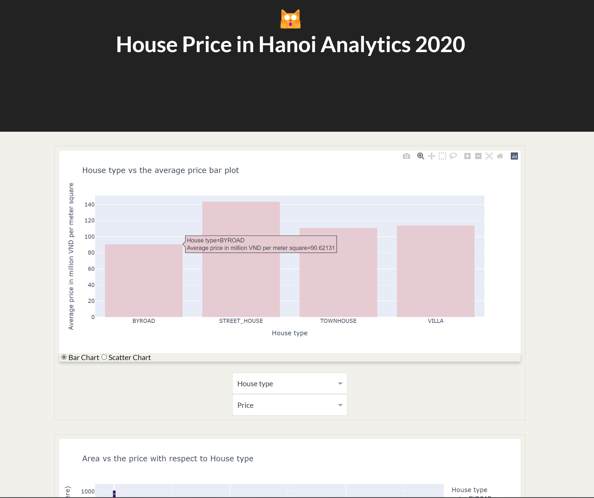
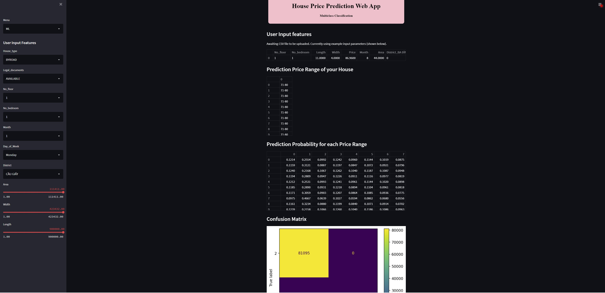

# Classify House Price Ranges in Hanoi





We will discuss:

1. **Data Analysis**
2. Feature Engineering
3. Feature Selection
4. Model Training
5. Obtaining Predictions / Scoring
6. Deploy by building a Dash and Streamlit API endpoint that was hosted on a local webserver


# Data

+ We will use the house price dataset available
  on [Kaggle.com](https://www.kaggle.com/c/house-prices-advanced-regression-techniques/data). See below for more
  details.

+ The data from that dataset comes from real estate listings posted on [Alo Nhà Đất](https://alonhadat.com.vn) that was
  crawled in August 2020 by [Le Anh Duc](https://www.kaggle.com/ladcva)

===========================================================================

## Predicting Sale Price Ranges of Houses in Hanoi

The aim of the project is to build a machine learning model to predict and classify the sale price ranges of homes based
on different explanatory variables describing aspects of residential houses.

### Why is this important?

Predicting house prices is useful to identify fruitful investments or to determine whether the price advertised for a
house is over or under-estimated in Hanoi.

### What is the objective of the machine learning model?

We aim to minimise the difference between the real price and the price estimated by our model. We will evaluate model
performance with the:

### Metrics

Metrics like accuracy, precision, recall are good ways to evaluate classification models for balanced datasets like what we would do in the project

### How do I download the dataset?

**Instructions also in the lecture "Download Dataset" in section 1 of the course**

- Visit the [Kaggle Website](https://www.kaggle.com/ladcva/vietnam-housing-dataset-hanoi).

- Remember to **log in**.

- The download the file called **'VN_housing_dataset.csv'** and save it in the directory with the notebooks.

**Note the following:**

- You need to be logged in to Kaggle in order to download the datasets.
- You need to accept the terms and conditions of the competition to download the dataset
- If you save the file to the directory with the jupyter notebook, then you can run the code as it is written here.

# Target variable

`Price_range`

# Problem Type

Multiclass Classification Problem


## Future improvement:

+ I would like to try out more stacking and ensemble methods to improve the model.


# WORKING ON YOUR LOCAL COMPUTER

python version 3.8.8

1. Install Conda
   by [following these instructions](https://conda.io/projects/conda/en/latest/user-guide/install/index.html). Add Conda
   binaries to your system `PATH`, so you can use the `conda` command on your terminal.

2. Install jupyter lab and jupyter notebook on your terminal

+ `pip install jupyterlab`
+ `pip install jupyter notebook`

### Jupyter Lab

1. Download the 3879312 zipped project folder. Unzip it by double-clicking on it.

2. In the terminal, navigate to the directory containing the project and install these packages and libraries

```
pip install -r requirements.txt
```

3. Enter the newly created directory using `cd directory-name` and start the Jupyter Lab.

```
jupyter lab
```

You can now access Jupyter's web interface by clicking the link that shows up on the terminal or by
visiting http://localhost:8888 on your browser.

4. Click on assignment2.ipynb in the browser tab. This will open up my main file in the Jupyter Lab.

### Note: If the Jupyter Notebook is not responding due to many requests

Error [(The page is not responding)](https://stackoverflow.com/questions/48615535/jupyter-notebook-takes-forever-to-open-and-then-pages-unresponsive-mathjax-i)

I had to restart the notebook; and it did not work. This is because I was printing out too much and the following
scripts resolved the issue by clear out all the output to run through the whole kernal:

1. `conda install -c conda-forge nbstripout` or `pip install nbstripout`

2. `nbstripout filename.ipynb`

### Dash

1. In the terminal, navigate to the directory containing the dash using `cd ./web_app/dash`

2. Start the dash local host by writing the following command line:

```
python app.py
```

3. You can now access Dash's web interface by clicking the link that shows up on the terminal or by visiting http://127.0.0.1:8050/ on your browser.

4. In case you want to have a new dataset, you need to input it into the assignment3.ipynb and run all the cells

5. After running the notebook, there will be an update csv file call `cleaned_data.csv` in Dash folder

6. You can repeat step 1

### Streamlit machine learning visualization and prediction deployment

1. In teh terminal, navigate to the directory containing the streamlit using `cd ./web_app/streamlit`

2. Start the streamlit local host by writing the following command line:

```
streamlit run app.py
```

3. You can now access Streamlit's web interface by clicking the link that shows up on the terminal or by visiting http://localhost:8501 or it will automatically popup the website on your browswer.

4. In case you want to have a new dataset, you need to input it inot the assignment3.ipynb and run all the cells

5. After running the notebook, there will be an update csv file call `cleaned_data.csv` in data folder

6. You can repeat step 1

## Repository Structure

```
├── LICENSE
├── Makefile           <- Makefile with commands like `make data` or `make train`
├── README.md          <- The top-level README for developers using this project.
├── data
│   ├── external       <- Data from third party sources.
│   ├── interim        <- Intermediate data that has been transformed.
│   ├── processed      <- The final, canonical data sets for modeling.
│   └── raw            <- The original, immutable data dump.
│
│
├── models             <- Trained and serialized models, model predictions, or model summaries
│
├── notebooks          <- Jupyter notebooks. Naming convention is a number (for ordering),
│                         the creator's initials, and a short `-` delimited description, e.g.
│                         `1.0-jqp-initial-data-exploration`.
│
├── reports            <- Generated analysis as HTML, PDF, LaTeX, etc.
│   └── figures        <- Generated graphics and figures to be used in reporting
│
├── requirements.txt   <- The requirements file for reproducing the analysis environment, e.g.
│                         generated with `pip freeze > requirements.txt`
│
|
├── src                <- Source code for use in this project.
│   ├── __init__.py    <- Makes src a Python module
│   │
│   ├── data           <- Scripts to download or generate data
│   │   └── make_dataset.py
│   │
│   ├── features       <- Scripts to turn raw data into features for modeling
│   │   └── build_features.py
│   │
│   ├── models         <- Scripts to train models and then use trained models to make
│   │   │                 predictions
│   │   ├── predict_model.py
│   │   └── train_model.py
│   │
│   └── visualization  <- Scripts to create exploratory and results oriented visualizations
│       └── visualize.py
|
│── web_app                <- Source code for web app.
│   │
│   ├── dash           <- Scripts to visualize data using Dash
│   │   └── app.py
│   │
│   ├── streamlit       <- Scripts to build preditive model using Streamlit -  an open-source Python library 
│     └── app.py
|
|── report.pdf 
|
|
│── .gitignore                <- plain text file contains files/directories to ignore

```

